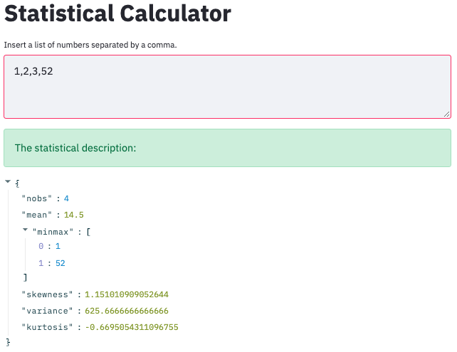

# Statistical Calculator Frontend
This repo uses streamlit to create a frontend for a simple API I created and hosted on AWS Lambda [here](https://github.com/DanielTemesgen/aws_statistical_calculator).

The streamlit is hosted on mybinder.
This is not worth an EC2 instance (or the trouble it would take to make it temporary) and streamlit doesn't currently support serverless deployments.

This builds on a POC proving the mybinder-streamlit link [here](https://github.com/chekos/testing-streamlit-mybinder).

## Components
Streamlit is great for quickly knocking up a frontend from a python script, it supports caching too which helps save on API calls.  
The requests library is used to form the API get request.  
Streamlit can catch errors and display them to the user for instance when the API response status code is not 200.
